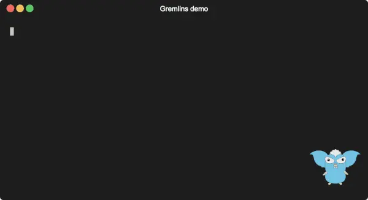

<p align="center" style="text-align: center">
  
  <h1 align="center" style="text-align: center">Gremlins</h1>
  <p align="center" style="text-align: center">A mutation testing tool for Go</p>
</p>

[](https://github.com/go-gremlins/gremlins/actions/workflows/ci.yml)
[](https://github.com/go-gremlins/gremlins/actions/workflows/gremlins.yml)
[](https://goreportcard.com/report/github.com/go-gremlins/gremlins)
[](https://codeclimate.com/github/go-gremlins/gremlins/maintainability)
[](https://deepsource.io/gh/go-gremlins/gremlins/?ref=repository-badge)
[](https://www.codacy.com/gh/go-gremlins/gremlins/dashboard?utm_source=github.com&amp;utm_medium=referral&amp;utm_content=go-gremlins/gremlins&amp;utm_campaign=Badge_Grade)
[](https://codecov.io/gh/go-gremlins/gremlins)
[](https://app.fossa.com/projects/git%2Bgithub.com%2Fgo-gremlins%2Fgremlins?ref=badge_shield)

Gremlins is a mutation testing tool for Go. It has been made to work well on _smallish_ Go modules, for example
_microservices_, on which it helps validate the tests, aids the TDD process and can be used as a CI quality gate.
As of now, Gremlins doesn't work very well on very big Go modules, mainly because a run can take hours to complete.



## Gremlins version

Gremlins is still in its 0.x.x release, which, as per SemVer, doesn't guarantee backward compatibility. What this
means for Gremlins is that configuration flags and/or configuration files can change among minor releases. This may
be important if you use Gremlins in automated builds, for example in _continuous integration_ pipelines.

Also, while in 0.x.x releases, only the current minor release will be maintained; if we are in v0.2.0, no patch
releases will be provided for the v0.1.0 line.
Once Gremlins will reach it's 1.x.x release, it will start to be backward compatible, and we'll decide how many
releases to maintain at the same time (ex. up to two minors before, as Go itself does).

## What is Mutation Testing

Code coverage is unreliable as a measure of test quality. It is too easy to have tests that exercise a piece of code but
don't test anything at all.

_Mutation testing_ works by mutating the code exercised by the tests and verifying if the mutation is caught by
the test suite. Imagine _gremlins_ going into your code and messing around: will your test suit catch their damage?

Here is a nice [intro to mutation testing](https://pedrorijo.com/blog/intro-mutation/).

## How to use Gremlins

Please refer to the [documentation](https://gremlins.dev) for instructions on how to obtain, configure and use Gremlins.

### Quick start

This is just to get you started, do not forget to check the complete [documentation](https://gremlins.dev).

Download the pre-built binary for your OS/ARCH from
the [release page](https://github.com/go-gremlins/gremlins/releases/latest)
and put it somewhere in the `PATH`, then:

```shell
gremlins unleash
```

Gremlins will report each mutation as:

- `RUNNABLE`: In _dry-run_ mode, a mutation that can be tested.
- `NOT COVERED`: A mutation not covered by tests; it will not be tested.
- `KILLED`: The mutation has been caught by the test suite.
- `LIVED`: The mutation hasn't been caught by the test suite.
- `TIMED OUT`: The tests timed out while testing the mutation: the mutation actually made the tests fail, but not
  explicitly.
- `NOT VIABLE`: The mutation makes the build fail.

## What inspired Gremlins

Mutation testing exists since the early days of computer science, so loads of papers and articles do exists. Gremlins is
inspired from those.

Among the existing mutation testing tools, Gremlins is inspired especially by [PITest](https://pitest.org/).

### Other Mutation Testing tools for Go

There is not much around, except from:

- [go-mutesting](https://github.com/avito-tech/go-mutesting#list-of-mutators)

## Contributing

See [contributing](docs/CONTRIBUTING.md).

## License

Gremlins is licensed under the [Apache 2.0 License](LICENSE).
The Gremlins documentation is licensed
under [CC BY-SA 4.0](http://creativecommons.org/licenses/by-sa/4.0/?ref=chooser-v1).
