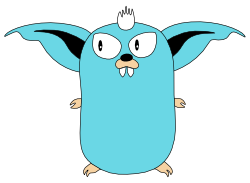

{ align=right }

# Welcome to Gremlins

Gremlins is a mutation testing tool for Go. It has been made to work well on _smallish_ Go modules, for example
_microservices_, on which it helps validate the test suite, aids the TDD process and can be used as a CI quality gate.

[//]: # (@formatter:off)
!!! warning
    Gremlins is still in its 0.x.x release, which, as per SemVer, doesn't guarantee backward compatibility. What this 
    means for Gremlins is that configuration flags and/or configuration files can change among minor releases. This may
    be important if you use Gremlins in automated builds, for example in _continuous integration_ pipelines.

    Also, while in 0.x.x releases, only the current minor release will be maintained; if we are in v0.2.0, no patch
    releases will be provided for the v0.1.0 line.
    Once Gremlins will reach it's 1.x.x release, it will start to be backward compatible, and we'll decide how many
    releases to maintain at the same time (ex. up to two minors before, as Go itself does).

[//]: # (@formatter:on)

## What is Mutation Testing

Code coverage is unreliable as a measure of test quality. It is too easy to have tests that exercise a piece of code but
don't test anything at all. Mutation testing works by mutating the code exercised by the tests and verifying if the
mutation is caught by the test suite. Imagine gremlins going into your code and messing around: will your test suit
catch their damage?

## Features

- Discovers mutant candidates and tests them
- Only tests mutants covered by tests
- Supports five mutant types
- Yaml-based configuration
- Can run as quality gate on CI
